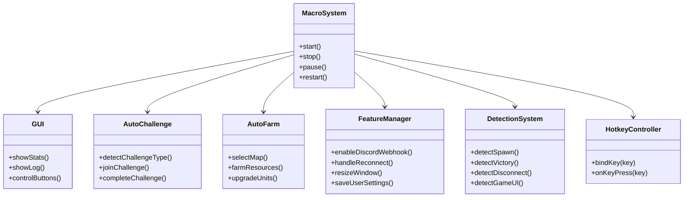
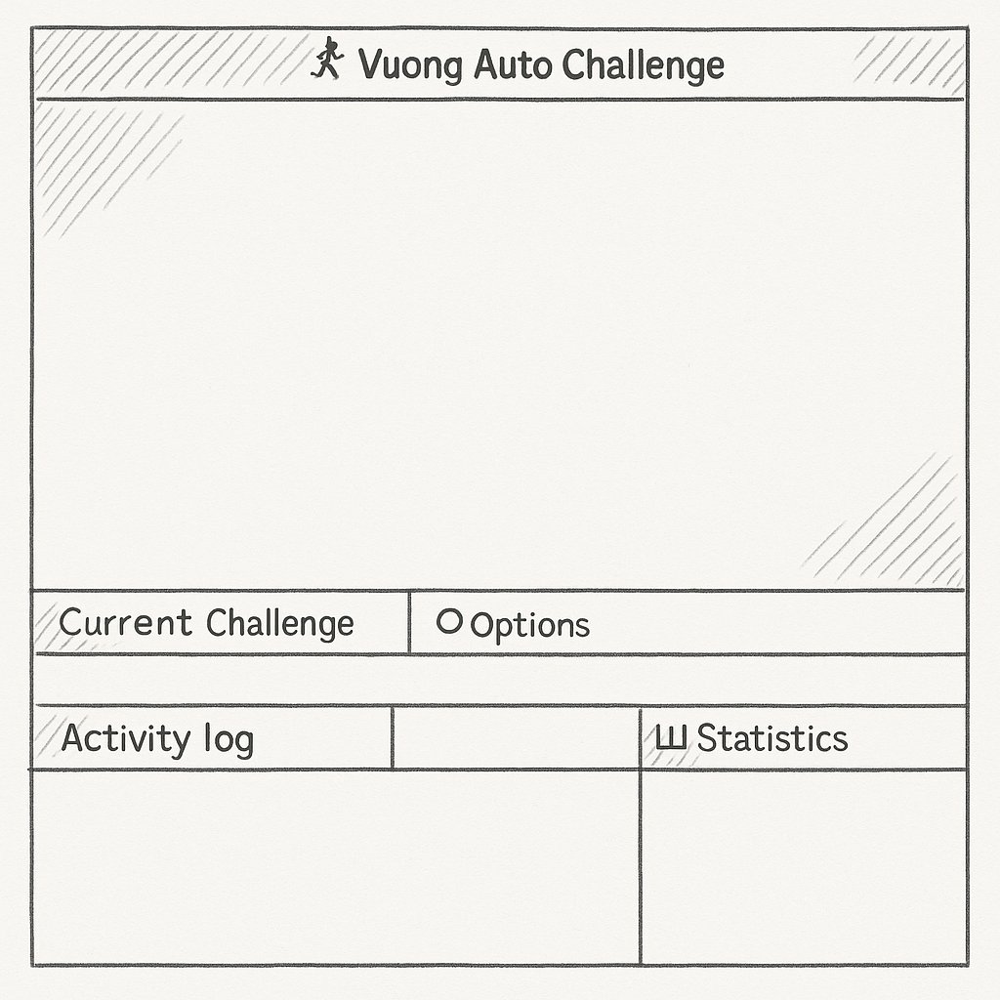

# 🎮 AUTO CHALLENGE TOOL – TỰ ĐỘNG CÀY GAME

> 🛠 **Nhóm phát triển:** Nhóm 0_9  
> 🕹 **Ngôn ngữ:** AutoHotkey (AHK)  
> 📁 **Dự án:** Tự động hóa thao tác trong game dạng phòng thủ

---

## 📌 MÔ TẢ DỰ ÁN

Auto Challenge là một công cụ viết bằng AutoHotkey giúp người dùng tự động chơi game theo cơ chế thủ tháp. Tool mô phỏng các thao tác của người chơi như tạo phòng, xây tháp, nâng cấp và chiến đấu để vượt qua các màn chơi, giảm thiểu thao tác thủ công và tiết kiệm thời gian.

---

## 📌 Sơ đồ chức năng tổng thể bằng Mermaid (kiểu nối với nhau)

---

Bạn có thể copy đoạn trên và chèn vào `README.md` để hiển thị sơ đồ chức năng kiểu nối với nhau bằng Mermaid trên GitHub.

## 🎯 MỤC TIÊU

- Tự động vào game và tạo phòng chơi
- Xây dựng tháp và nâng cấp theo chiến lược
- Tự vượt màn khi đủ điều kiện
- Tự động reconnect (rejoin) khi bị mất kết nối
- Chạy ổn định, không lỗi
- Có giao diện cài đặt dễ sử dụng
- Gửi thông báo hoặc log qua Discord webhook

---

## ⚙️ CÁC CHỨC NĂNG CHÍNH

| Chức năng                         | Mô tả                                                                 |
|----------------------------------|-----------------------------------------------------------------------|
| Vào game tự động                 | Tự động khởi chạy game và tạo phòng mới                              |
| Tự xây tháp                      | Phân tích và triển khai chiến thuật xây tháp theo từng loại màn      |
| Nâng cấp & quản lý tài nguyên    | Tự nâng cấp tháp theo trình tự đã định sẵn                            |
| Vượt màn                         | Kiểm tra điều kiện thắng và tự động chuyển màn tiếp theo             |
| Rejoin khi mất kết nối          | Tự động reconnect nếu bị out khỏi phòng                              |
| Giao diện người dùng (GUI)       | Cho phép người dùng bật/tắt tính năng, chỉnh cài đặt                  |
| Gửi log qua Discord              | Hỗ trợ gửi thông báo qua webhook (ví dụ khi hoàn thành nhiệm vụ)     |

---

## Ảnh demo UI

---
> © 2025 Nhóm 0_9 – Tự động hóa để chiến thắng!